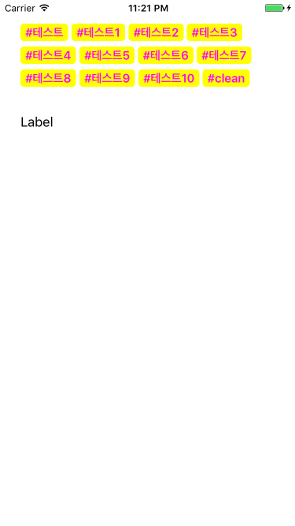

# KUITagLabel

[](https://travis-ci.org/Kofktu/KUITagLabel)

[](http://cocoapods.org/?q=name%3AKUITagLabel%20author%3AKofktu)
[](https://github.com/Carthage/Carthage)



- TagLabel support for Dynamic height
- Support for Accessiblity

## Requirements

- iOS 8.0+
- Xcode 9.0
- Swift 4.0 (>= 2.0.0)
- Swift 3.0 (>= 1.5.0)

## Installation

#### CocoaPods
KUITagLabel is available through [CocoaPods](http://cocoapods.org). To install
it, simply add the following line to your Podfile:

```ruby
pod "KUITagLabel"
```

#### Carthage
For iOS 8+ projects with [Carthage](https://github.com/Carthage/Carthage)

```
github "Kofktu/KUITagLabel"
```


## Usage

#### KUITagLabel
```Swift
import KUITagLabel

let config = KUITagConfig(titleColor: UIColor.magentaColor(),
                          titleFont: UIFont.boldSystemFontOfSize(15.0),
                          ...)

tagLabel.add(KUITag(title: "#테스트", config: config))
tagLabel.add(KUITag(title: "#테스트1", config: config))
tagLabel.refresh()


```

## Authors

Taeun Kim (kofktu), <kofktu@gmail.com>

## License

KUITagLabel is available under the ```MIT``` license. See the ```LICENSE``` file for more info.
